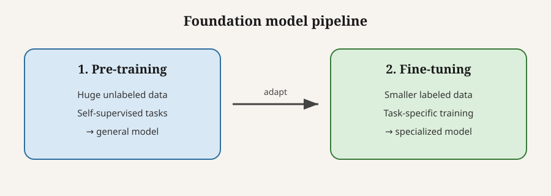
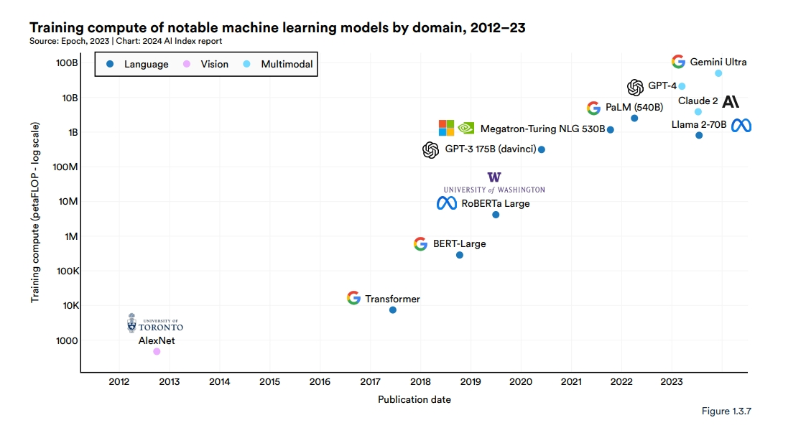
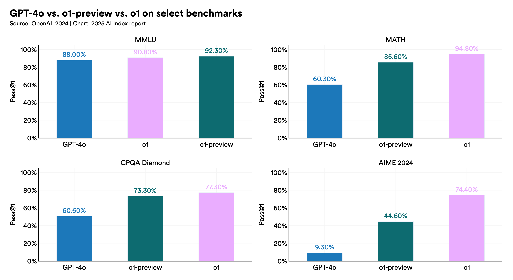

# What Are Foundation Models?

*The apps are the road. The foundation model is what holds them up.*

We experience AI today through the traffic on that road — consumer interfaces like ChatGPT or the Claude web app, coding copilots, and image generators. Beneath them sits the infrastructure holding the traffic up: the **foundation models** themselves (like GPT-4o, Claude 3, or Gemini 1.5). People use the phrase loosely, as if every neural network trained from scratch counted. It does not. **A foundation model is trained on broad data with self-supervision at scale and then adapted to many downstream tasks; models still differ mainly through data mix, post-training, scale, and evaluation — so you tell them apart by matching the job to the right benchmark, not by chasing a single overall winner.**

Stanford’s Center for Research on Foundation Models (CRFM) coined the term in 2021 and defined it this way:

> A foundation model is any model that is trained on broad data (generally using self-supervision at scale) that can be adapted (e.g., fine-tuned) to a wide range of downstream tasks.[1](https://arxiv.org/abs/2108.07258)

That sentence has three load-bearing parts. **Broad data** means the training mix is general, not a single labeled job. **Self-supervision at scale** means the model mostly learns by predicting missing pieces of raw data rather than from hand-labeled examples. **Adapted to a wide range of downstream tasks** means the same base is reused — via fine-tuning, prompting, or related methods — for many jobs after the base is built. Industry explainers match this picture: NVIDIA describes a neural network trained on mountains of raw data that can be steered to many tasks;[2](https://blogs.nvidia.com/blog/what-are-foundation-models/) IBM contrasts older one-job models with large general models specialized later.[3](https://www.ibm.com/think/topics/foundation-models) CRFM chose “foundation” to stress two properties at once: the model is **central** (many products stand on it) and **incomplete** (it is not the finished product until adapted).[1](https://arxiv.org/abs/2108.07258)

Two further CRFM ideas explain why the category matters. **Emergence** means that at scale, models show useful behaviors nobody programmed line by line — for example, attempting a new task from a natural-language prompt. **Homogenization** means many teams converge on the same few bases and methods. Homogenization amortizes effort; it also creates a shared failure mode: if the foundation is biased or brittle, every adapted system inherits the crack.[1](https://arxiv.org/abs/2108.07258)

How does that base get learned? Mostly through **self-supervised learning**. Instead of labeling every example, you force the model to predict a missing piece of the data itself. For text, that is often next-word or masked-word prediction (“The cat sat on the ___”). Enough of those predictions, on a large enough corpus, and the model absorbs language structure and a large amount of world-shaped pattern. Images and code use the same spirit — reconstruct a patch, predict the next tokens.

Then comes the rare, industrial step. **Pretraining** is the long run that builds the general base: months of work, mountains of data, thousands of accelerators chewing through tokens. Almost no one repeats that run for every product. Instead they do **adaptation** — prompting, fine-tuning, alignment or preference training, and lighter methods such as LoRA (train a small add-on instead of every weight)[11](https://arxiv.org/abs/2106.09685) or retrieval-augmented generation (RAG), which fetches documents and conditions the answer on them.[10](https://arxiv.org/abs/2005.11401) The pattern is transfer learning at industrial scale: you stand on the foundation rather than pour a new one.

*Pretrain once for generality. Adapt for a real job.*

The technical spine of that story is short and well documented. The **transformer** architecture (*Attention Is All You Need*, 2017) made attention-based networks scale.[4](https://arxiv.org/abs/1706.03762) **BERT** (2018) normalized “one pretrained language model, many fine-tunes.”[5](https://arxiv.org/abs/1810.04805) **GPT-3** (2020) showed few-shot prompting on a model with about **175 billion parameters** — the learned weights inside the network.[6](https://arxiv.org/abs/2005.14165) ChatGPT and diffusion-based image models then made the paradigm visible outside the lab. The Stanford AI Index counted **149** foundation models published in 2023 alone.[7](https://aiindex.stanford.edu/) One clarification for precision: a large language model (LLM) is one *kind* of foundation model — language. Foundations also include speech systems (e.g. Whisper), image systems (e.g. diffusion / vision bases), and multimodal models. Same definition; different data and outputs.

That scale is also why people say pretraining needs massive resources. Building the base burns three fuels at once — **data** (internet-scale text, code, images, filtered and tokenized), **compute** (thousands of accelerators for weeks or months; often reported as training FLOPs, i.e. how much math the chips performed), and **people plus energy**. Opening a chat window is not the same activity as pretraining GPT. Public dollar figures are estimates — labs rarely publish a full receipt — but the AI Index, working with Epoch AI, estimated cloud-rental compute for the training run alone: the original Transformer on the order of **~$900**; RoBERTa Large about **~$160,000**; GPT-4 about **~$78 million**; Gemini Ultra about **~$191 million**.[8](https://hai.stanford.edu/ai-index/2024-ai-index-report/research-and-development) Those numbers are not total R&D, yet they are enough to explain the industry split: a few organizations pretrain; almost everyone else adapts.

*Training compute of notable models, 2012–23 (log scale). Epoch data via Stanford AI Index. Log scale means each step up is a large jump.*[7](https://aiindex.stanford.edu/)

If the high-level recipe is shared — broad data, self-supervision, then adaptation — why do foundation models still feel so different? For most chat models, the answer is not a secretly different brain. Most still use transformers. Architecture matters most when the *job type* changes (for example, text chat versus diffusion for images).[9](https://www.ibm.com/think/topics/diffusion-models) Within chat models, the splits that matter are quieter and more expensive: **data mix** — how much code, math, dialogue, books, multilingual text, or images the model saw; **post-training** — instruction tuning, preference / RLHF-style training, and domain fine-tunes that steer writing, coding, refusal, and reasoning; **scale and training recipe** — parameter count, tokens seen, compute, and designs such as mixture-of-experts; and **evaluation** — what you measure, because a model can lead on coding and lag on long-form writing. Major generations (for example GPT-3 to GPT-4 class) are usually new pretraining runs. Inside a generation, much of the product change is post-training on a related base.

That last split is how you tell models apart without inventing a fake overall ranking. A **benchmark** is a fixed test of a skill. A high score means strong on *that* skill — not “best foundation model overall.” Read the evidence that way:

| If you care about… | Look at signals like… |
| --- | --- |
| Chat / writing preference | LMArena (human A/B votes)[14](https://lmarena.ai/) |
| Coding / agents | Coding arenas, SWE-bench-style suites |
| Hard science / math | GPQA, MATH, contest math (e.g. AIME) |
| Multimodal | MMMU and related vision–language suites |
| Quality vs price vs speed | Artificial Analysis[15](https://artificialanalysis.ai/leaderboards/models) |
| Open weights vs closed API | AI Index trends; Hugging Face hub[13](https://hai.stanford.edu/ai-index/2025-ai-index-report/technical-performance)[12](https://huggingface.co/models) |

A concrete example makes the method clear. The 2025 AI Index reprints OpenAI’s comparison of GPT-4o, o1-preview, and o1. Do not begin with “who won.” Begin with each **panel title** — that is the skill under test.

*GPT-4o vs o1-preview vs o1. Chart: 2025 AI Index (OpenAI, 2024).*[13](https://hai.stanford.edu/ai-index/2025-ai-index-report/technical-performance)

On **MMLU** (broad general knowledge), the bars sit close (~88–92%). Judged only there, the models look almost interchangeable. On **MATH**, **GPQA Diamond**, and **AIME 2024**, the gap opens; on AIME, GPT-4o is about **9%** while o1 is about **74%**. Same lab and era; different measured strengths. Name the skill first, then trust the ranking for that skill only.

For orientation — not as a claim that any row is permanently “best” — these are families readers will keep meeting:[2](https://blogs.nvidia.com/blog/what-are-foundation-models/)

| When | Family | Role |
| --- | --- | --- |
| 2018 | **BERT** | Pretrain + fine-tune for understanding / search[5](https://arxiv.org/abs/1810.04805) |
| 2020 | **GPT-3** | Few-shot text; early API apps[6](https://arxiv.org/abs/2005.14165) |
| 2022 | **Stable Diffusion**, **Whisper** | Text-to-image; speech-to-text |
| 2022– | **GPT**, **Claude**, **Gemini** | Chat, coding help, multimodal assistants |
| 2023– | **Llama**, **Mistral**, **Qwen**, **DeepSeek**… | Open-weight bases to deploy or fine-tune[12](https://huggingface.co/models) |
| Also | Code models; **AlphaFold**, **SAM**, world models | Coding; science / vision / physical AI |

None of this evidence licenses blind trust. Capability and failure arrive together. Models **hallucinate** (fluent but false), can amplify **bias** in training data, raise privacy and IP questions, and cost real energy. Because of homogenization, one cracked foundation can crack many products.[1](https://arxiv.org/abs/2108.07258) Grounding (for example RAG), filtering, red-teaming, and monitoring are therefore part of responsible use — not optional polish after the “real” work of picking a model name.

So a foundation model — in the CRFM sense — is not “any model trained from scratch.” It is a model trained on broad data with self-supervision at scale and then adapted to many downstream tasks. That shared recipe explains both the power of the paradigm and the confusion around it. Models still differ because of data mix, post-training, scale and recipe, and what we choose to measure. The sound way to tell which is which is evidence-based and task-relative: read the benchmark for the skill you need, then adapt. Treat the foundation as a base layer, not the product; spend scarce resources on the right evaluation and on adaptation; and remember that when many systems stand on one floor, the quality of that floor is everyone’s problem.

---

## Notes

1. Bommasani et al., *On the Opportunities and Risks of Foundation Models* (Stanford CRFM / HAI, 2021). Formal definition + emergence / homogenization. [arXiv](https://arxiv.org/abs/2108.07258) · [CRFM](https://crfm.stanford.edu/report.html)
2. NVIDIA, “What Are Foundation Models?” [Link](https://blogs.nvidia.com/blog/what-are-foundation-models/)
3. IBM Think, “What are foundation models?” [Link](https://www.ibm.com/think/topics/foundation-models)
4. Vaswani et al., *Attention Is All You Need* (2017). [arXiv](https://arxiv.org/abs/1706.03762)
5. Devlin et al., *BERT* (2018). [arXiv](https://arxiv.org/abs/1810.04805)
6. Brown et al., GPT-3 (2020). [arXiv](https://arxiv.org/abs/2005.14165)
7. Stanford AI Index 2024. [Link](https://aiindex.stanford.edu/)
8. Stanford AI Index 2024 — training-cost estimates (Epoch AI). [Link](https://hai.stanford.edu/ai-index/2024-ai-index-report/research-and-development)
9. IBM Think, diffusion models. [Link](https://www.ibm.com/think/topics/diffusion-models)
10. Lewis et al., RAG (2020). [arXiv](https://arxiv.org/abs/2005.11401)
11. Hu et al., LoRA (2021). [arXiv](https://arxiv.org/abs/2106.09685)
12. Hugging Face model hub. [Link](https://huggingface.co/models)
13. Stanford AI Index 2025 — Technical performance. [Link](https://hai.stanford.edu/ai-index/2025-ai-index-report/technical-performance)
14. LMArena. [Link](https://lmarena.ai/)
15. Artificial Analysis. [Link](https://artificialanalysis.ai/leaderboards/models)
